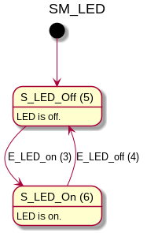
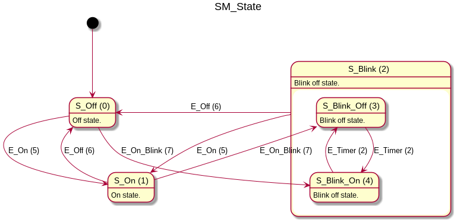

# thism2
Templated hierachical state machine framework

  - Complete state machine definition at compile time
  - Automatic generation of state machine diagrams
  - Consistency checks at compile time
  - Automatic static instantiation of state classes
  - Minimal memory footprint

## Features of the framework

  - Minimal boilerplate code for defining events. E.g. 
    ~~~
    struct E_Event1; MAKE_EVENT(E_Event1, 0);
    ~~~
  - Minimal boilerplate code for states
    - defining state, state name and description
    - defining hierachy relations
    - defining transitions in response to events
    - defining 
    ~~~
    struct S_State1 : public StateBase {
        StateSetup(S_State1, "Description of the start.") { }

        typedef StateDetails< void, TransitionListT<
            TransitionT<E_Timer, S_State2>
        > > details;
    }
    struct S_State2 : public StateBase {
        StateSetup(S_State2, "Description of the start.") { }

        typedef StateDetails< S_State1, TransitionListT<
            TransitionT<E_Timer, S_State1>
        > > details;
    
        void onEnter(uint16_t senderStateId, uint16_t event, bool isDestState, bool reentering) final;
    }
    ~~~
  - Macro for defining state machines with an initial state
    ~~~
    struct SM_States;
    Make_StateMachine(SM_States, MarkInitialState<S_State1>, S_State2, S_State2);
    ~~~
  - Macro for defining states that share a timer
    ~~~
    typedef SMTimer<Collector<S_State1, S_State1>> SMT_Std;
    ~~~
  - Macro for defining a system of one or more state machines
    ~~~
    typedef SMSystem<EventList, Collector<SM_State, SM_LED>, 
        SMTimerListTmpl<EventList, SMT_Std>> SMSys;
    ~~~
  - Automatically create state machines diagrams with [PlantUML](https://plantuml.com/)  

There are multiple consistency checks that are executed when defining states and the systems of state machines:
  - States have to be set up correctly 
  - Transitions must be within one state machine, e.g. a transition must take place between two states that belong to the same state machine
  - ...
  
## Example 

In subdirectory _example/_, an example consisting of two  simple state machines can be found.

 

## API

### MAKE_EVENT
~~~
#define MAKE_EVENT(EVENTNAME, OPTS)
~~~
Example:
~~~
MAKE_EVENT(E_LED_on, 0);
~~~

### MAKE_EVENT_LIST
~~~
#define MAKE_EVENT_LIST(XXX, ...)
~~~
Example:
~~~
MAKE_EVENT_LIST(EventList, E_LED_on, E_LED_off, E_On, E_Off, E_On_Blink);
~~~

### Make_StateMachine
~~~
#define Make_StateMachine(SMName, ...)
~~~
Example:
~~~
Make_StateMachine(SM_State, MarkInitialState<S_Off>, S_On, S_Blink, S_Blink_Off, S_Blink_On);
~~~

### StateSetup
~~~
StateSetup(STATECLASSNAME, DESCRIPTION)
~~~
Example:
~~~
struct S_Off : public StateBase {
    StateSetup(S_Off, "Off state.") { }

    /* more code */
}
~~~